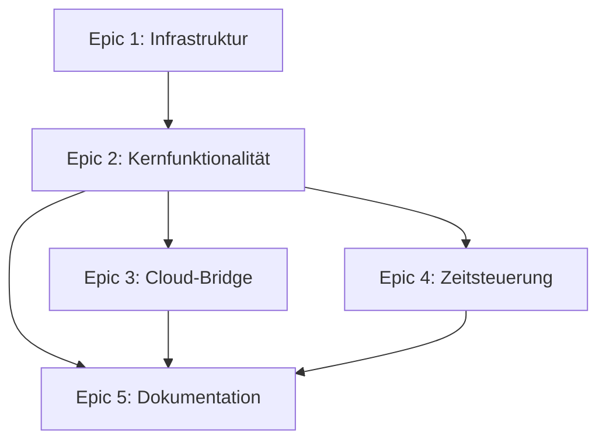

# Projekt-Roadmap: Marstek Jupiter C+ Home Assistant Add-on

Dieses Dokument dient als Masterplan für die Entwicklung des Add-ons. Es gliedert das Projekt in Epics, definiert Meilensteine (Milestones) und identifiziert Abhängigkeiten zwischen den Arbeitspaketen.

## Epics

### Epic 1: Plattformierung & Release-Infrastruktur
**Ziel:** Das Add-on von einem lokalen Entwicklungsprojekt in eine veröffentlichbare und wartbare Software überführen.
- **Milestone 1.1: GitHub Repository & CI/CD**
  - Aufsetzen des öffentlichen GitHub-Repositorys (Naming: `marstek-jupiter-ha-addon`).
  - Konfiguration von GitHub Actions für automatisierte Docker-Builds (Multi-Arch: `amd64`, `aarch64`, `armv7`).
  - Einführung von Semantic Versioning und automatischen Changelogs.
- **Milestone 1.2: Docker-Image Optimierung**
  - Finales Testen und Optimieren des `Dockerfile`s für minimale Image-Größe und schnelle Startzeiten.
  - Sicherstellung, dass das Image auf verschiedenen Home Assistant-Architekturen lauffähig ist.
- **Milestone 1.3: Supervisor-Konformität**
  - Sicherstellen, dass `config.yaml`, `run.sh` und Health-Endpoint den aktuellen Home Assistant Supervisor-Spezifikationen entsprechen.

### Epic 2: Kernfunktionalität & Stabilität
**Ziel:** Die zuverlässige Kommunikation mit dem Marstek-Gerät über MQTT sicherstellen und alle wesentlichen Datenpunkte abdecken.
- **Milestone 2.1: MQTT-Kern & Discovery**
  - Implementierung einer robusten MQTT-Verbindungslogik (Wiederverbindung bei Verbindungsverlust).
  - Automatische Home Assistant Discovery für alle Grundsensoren (SOC, Leistung, Tagesstatistiken).
  - Validierung der Topic-Verschlüsselung (AES-128-CBC) für `hame-2025` Broker.
- **Milestone 2.2: Steuerung (Write-Operations)**
  - Implementierung der Steuer-Entities:
    - `Switch`: Überschusseinspeisung (`full_d`).
    - `Select`: Arbeitsmodus (`md` - `automatic` / `manual`).
    - `Number`: Entladetiefe (`dod`, 30-88%).
  - Command-Builder mit Validierung und Retry-Logik.
- **Milestone 2.3: Erweiterte Sensoren & Diagnose**
  - Hinzufügen von Zell-Level-Daten (`enable_cell_data: true`).
  - Implementierung detaillierterer Diagnose-Logs (`trace`, `debug`) für die Fehlersuche.

### Epic 3: Cloud-Bridge & Erweiterte Konnektivität
**Ziel:** Optionale, aber vollständige Integration der Hame/Marstek Cloud-API.
- **Milestone 3.1: Cloud-API Integration**
  - Implementierung des `HameApiClient` (Login, Session-Management, Device-Discovery).
  - Fallback-Mechanismus: Bei fehlgeschlagener Cloud-Verbindung wird automatisch auf den rein lokalen Mosquitto-Broker umgeschaltet.
- **Milestone 3.2: Cloud-MQTT Bridge**
  - Bidirektionale Weiterleitung von MQTT-Nachrichten zwischen lokalem Mosquitto und Hame Cloud Broker.
  - Sicherstellung, dass Steuerbefehle über die Cloud ebenso zuverlässig ankommen wie über das lokale Netzwerk.

### Epic 4: Zeitsteuerung & Automatisierung
**Ziel:** Dem Nutzer erweiterte Steuerungsmöglichkeiten über Zeitpläne bieten.
- **Milestone 4.1: Time-Period Entities**
  - Implementierung von Home Assistant `number`-Entities zum Setzen von Ladezeitplänen.
  - Mapping der HA-Eingaben auf die `cd=3` Commands des Geräts.
- **Milestone 4.2: Zeitpläne via UI**
  - Erstellung einer optionalen, einfachen Web-Oberfläche (geserved vom Add-on selbst) zur komfortablen Konfiguration von Zeitplänen, falls die HA-eigenen Automatisierungen nicht ausreichen.

### Epic 5: Dokumentation & Community
**Ziel:** Das Add-on für Endnutzer zugänglich und verständlich machen.
- **Milestone 5.1: Endnutzer-Dokumentation**
  - Fertigstellung der `README.md` mit Installation, Konfiguration und Troubleshooting (Teilweise erledigt).
  - Erstellung eines `DOCS.md` für den Home Assistant Add-on Store.
- **Milestone 5.2: Entwickler-Dokumentation**
  - Dokumentation des internen Protokolls (Commands, Parser, Verschlüsselung).
  - Einrichtung einer `CONTRIBUTING.md` für Open-Source-Mitarbeiter.

## Abhängigkeiten & Reihenfolge

**Kritische Pfad-Analyse:**
- **Blockierend:** Ohne Epic 1 kann kein stabiles Docker-Image erstellt werden.
- **Blockierend:** Epic 2 ist die absolute Voraussetzung für Epic 3 und 4, da diese auf der grundlegenden MQTT-Kommunikation aufbauen.
- **Empfohlene Reihenfolge:** Epic 1.1 -> Epic 2.1 -> Epic 2.2 -> Epic 1.2 -> Epic 5.1 -> (Epic 3.1 -> Epic 3.2) / (Epic 4.1 -> Epic 4.2)

## Vorschläge für Kurz- und Langfristige Ziele

### Kurzfristig (Next Steps)
- [ ] Abschluss der Epic 1.1 (GitHub Repo + Push).
- [ ] Implementierung und Test von Epic 2.1 (Robuste MQTT-Discovery).
- [ ] Finales Review der `config.yaml` um Home Assistant Supervisor-Konformität zu garantieren.

### Mittelfristig (Post-MVP)
- [ ] Implementierung von Epic 2.2 (Schalter für Überschusseinspeisung und Modus).
- [ ] Aufbau der Cloud-Bridge (Epic 3).
- [ ] Einführung von Unit-Tests für den Parser und die Verschlüsselungslogik.

### Langfristig (Erweiterte Features)
- [ ] Implementierung von Epic 4 (Zeitsteuerung).
- [ ] Community-Building und Erfassen von Feedback für die Unterstützung weiterer Marstek-Geräte (Jupiter 5k/10k).
- [ ] HACS-Integration als Alternative zur Supervisor-Installation.

## Meilenstein-Tabelle

| Meilenstein | Epic | Status | Zieltermin |
| :--- | :--- | :--- | :--- |
| v1.0.0 MVP | 1, 2 | `In Arbeit` | Sofort |
| v1.1.0 Steuerung | 2.2 | `Geplant` | Nach Docker-Test |
| v1.2.0 Cloud-Bridge | 3 | `Geplant` | Nach v1.1.0 |
| v1.3.0 Zeitsteuerung | 4 | `Geplant` | Zukünftig |
| v2.0.0 Community-Release | 5 | `Zukünftig` | Langfristig |
